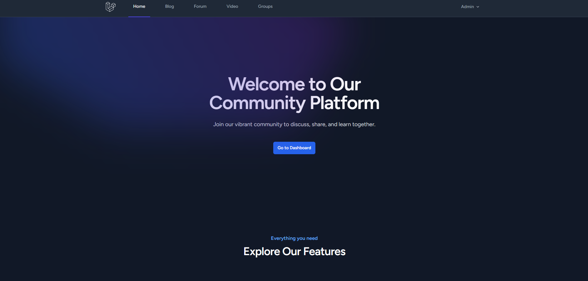

# Laravel Community Platform



A **feature-rich** community platform built with **Laravel**, providing a seamless experience for users to interact through **blogs, forums, video sharing, and group creation**. The platform includes a **powerful admin panel** for managing categories and administrative tasks. The core structure is functional and **open for further development**.

---

## 🚀 Features

✅ **Blog System** - Users can create, edit, and manage blog posts.
✅ **Forum** - Engage in topic-based discussions.
✅ **Video Sharing** - Upload and share videos easily.
✅ **Groups** - Create and manage public or private groups.
✅ **Admin Panel** - Manage categories, content, and users with ease.
✅ **User Authentication** - Secure login and registration system.
✅ **Responsive UI** - Mobile-friendly design.
✅ **Role Management** - Assign user roles and permissions.

---

## 📌 Installation

### ⚡ Requirements
- **PHP** 8.0+
- **Laravel** 10+
- **MySQL/PostgreSQL** database
- **Composer** (Dependency Manager)
- **Node.js & NPM** (For frontend assets)

### 📥 Steps to Install

1️⃣ **Clone the repository:**
   ```sh
   git clone https://github.com/RecLast/LaravelBlog-Community.git
   cd LaravelBlog-Community
   ```

2️⃣ **Install PHP dependencies:**
   ```sh
   composer install
   ```

3️⃣ **Install frontend dependencies:**
   ```sh
   npm install && npm run dev
   ```

4️⃣ **Set up environment variables:**
   ```sh
   cp .env.example .env
   ```
   Configure your database and other environment settings in the `.env` file.

5️⃣ **Generate application key:**
   ```sh
   php artisan key:generate
   ```

6️⃣ **Run database migrations and seeders:**
   ```sh
   php artisan migrate --seed
   ```

7️⃣ **Start the development server:**
   ```sh
   php artisan serve
   ```
   The application will now be accessible at `http://127.0.0.1:8000`.

---

## 📖 Usage

- **Access the platform** via `http://127.0.0.1:8000`
- **Register/Login** to start interacting with the community.
- **Explore blogs, forums, videos, and groups**.
- **Use the Admin Panel** to manage content and users.

---

## 🤝 Contribution

Contributions are welcome! To contribute:
1. **Fork** the repository
2. **Create a new branch** (`feature-new`)
3. **Commit your changes**
4. **Push to your branch**
5. **Create a Pull Request**

---

## 🛡️ License

This project is licensed under the **MIT License**. See the [LICENSE](LICENSE) file for more details.

---

## 📬 Contact

For inquiries or feature requests, open an issue or contact me at [iletisim@umiteski.com.tr].

---

_🎉 Happy Coding!_ 🚀
